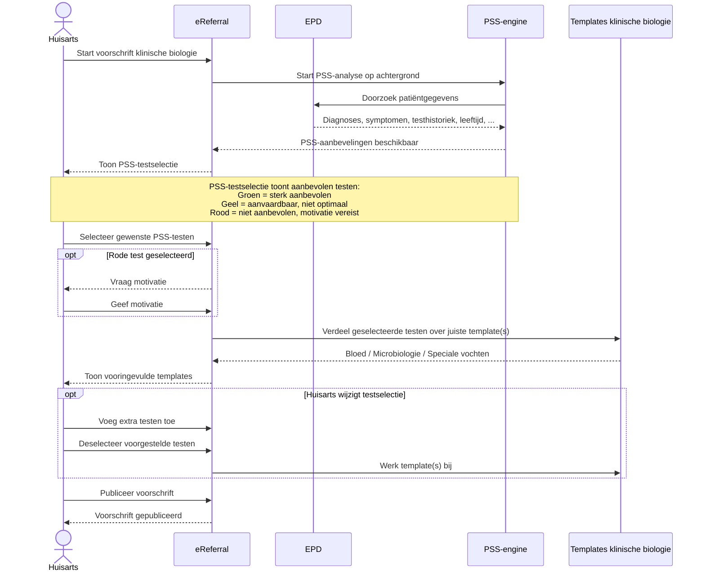
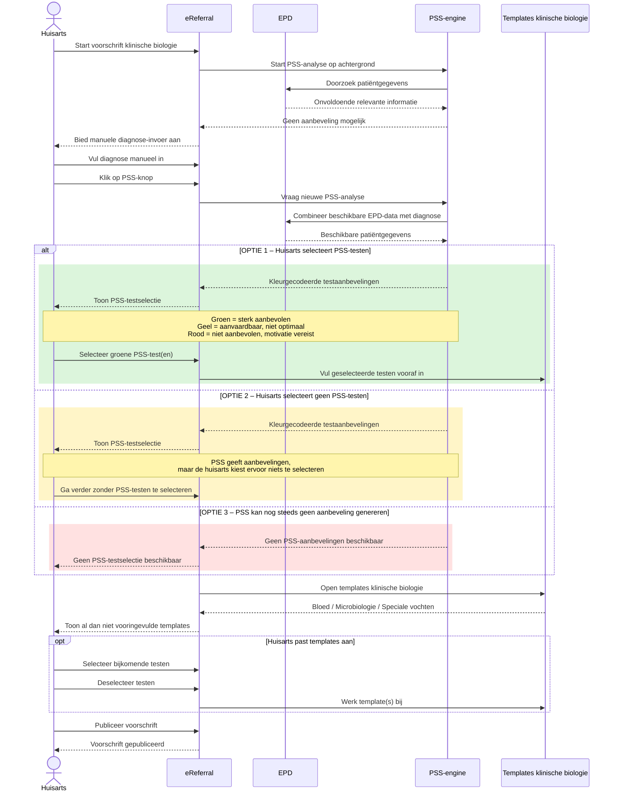
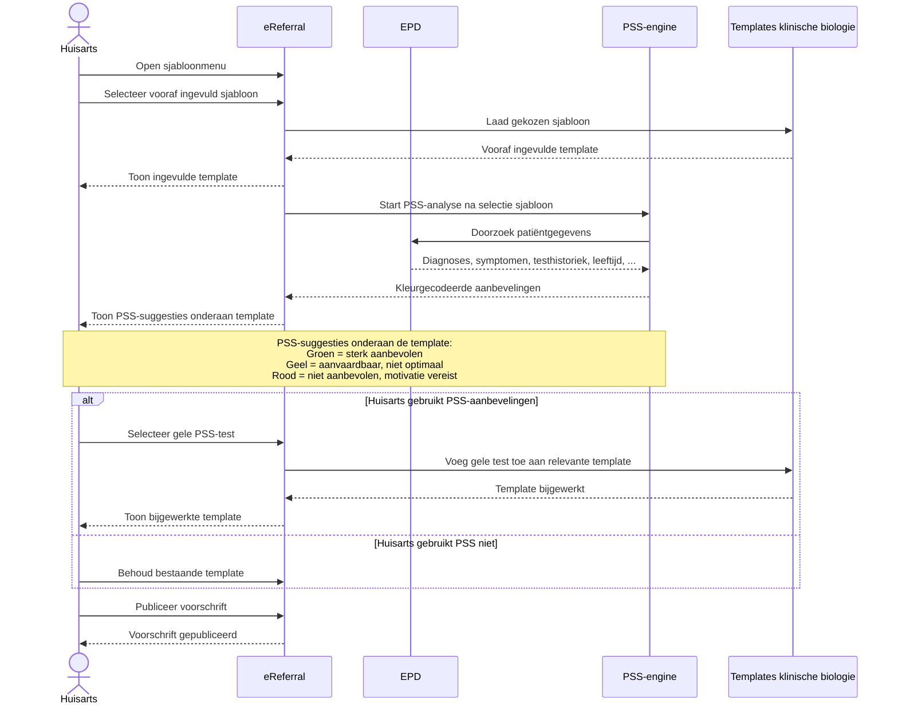

# PSS – eReferral Klinische Biologie

Dit document visualiseert drie mogelijke workflow-varianten voor de integratie van **Prescription Search Support (PSS)** binnen het **RIZIV-INAMI eReferral-platform** voor voorschriften klinische biologie.

De Mermaid-diagrams hieronder worden rechtstreeks door GitHub gerenderd in Markdown.

---

## Scenario 1 – PSS-first: PSS-testselectie vóór de templates

---

## Scenario 2 – Onvoldoende EPD-data: manuele diagnose en drie mogelijke uitkomsten

---

## Scenario 3 – Vooraf ingevuld sjabloon eerst, PSS-suggesties daarna

---

## Actoren

| Actor / component | Rol |
|---|---|
| **Huisarts** | Voorschrijver |
| **eReferral** | Platform waarin het voorschrift wordt opgesteld en gepubliceerd |
| **EPD** | Bron van diagnoses, symptomen, testhistoriek, leeftijd en andere relevante patiëntgegevens |
| **PSS-engine** | Genereert kleurgecodeerde aanbevelingen voor klinische biologie |
| **Templates klinische biologie** | Bloed, Microbiologie en Speciale vochten |

## PSS-kleurcodering

- **Groen** – sterk aanbevolen
- **Geel** – aanvaardbaar, niet optimaal
- **Rood** – niet aanbevolen; motivatie vereist
