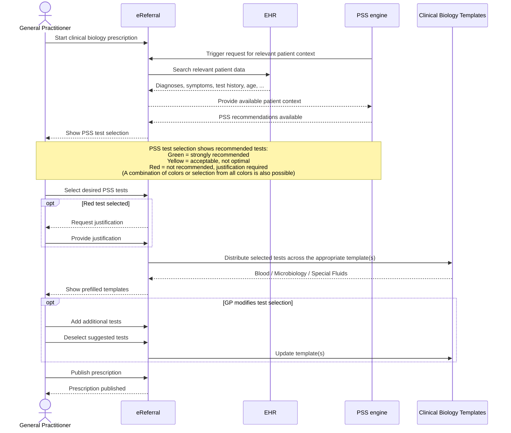
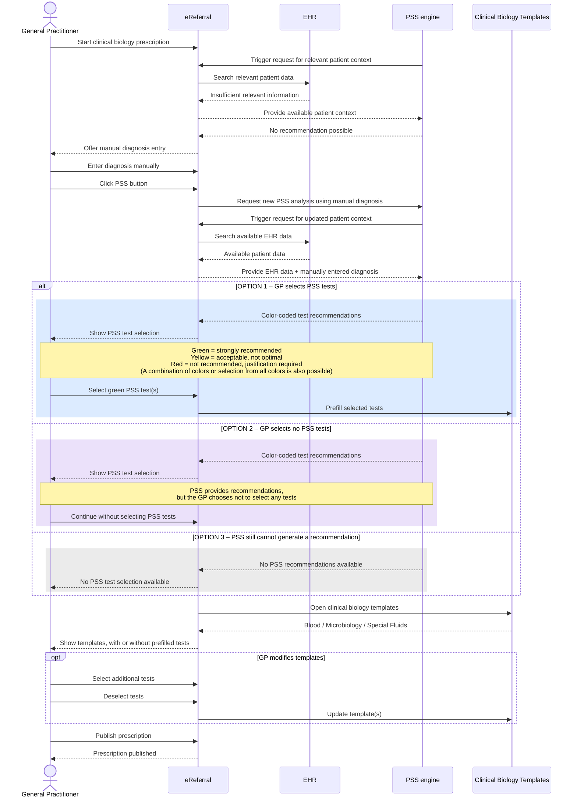
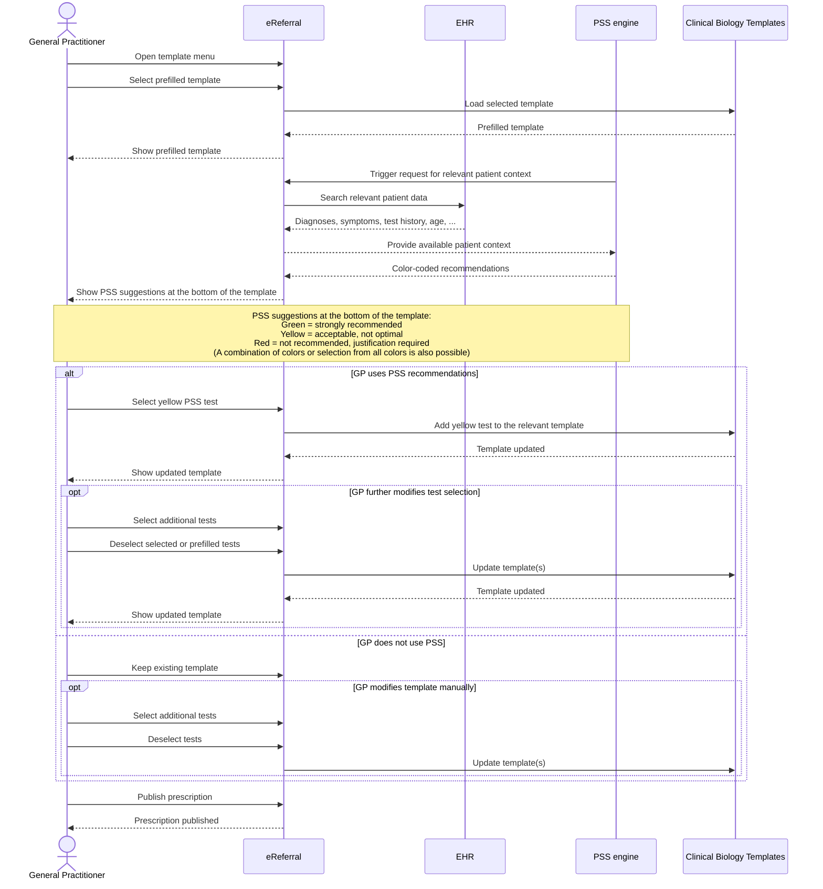

# PSS – eReferral Clinical Biology

This document visualizes three possible workflow variants for the integration of **Prescription Search Support (PSS)** within the **RIZIV-INAMI eReferral platform** for clinical biology prescriptions.

The Mermaid diagrams below are rendered directly by GitHub in Markdown.

---

## Scenario 1 – PSS-first: PSS test selection before the templates

---

## Scenario 2 – Insufficient EHR data: manual diagnosis entry and three possible outcomes

---

## Scenario 3 – Start from a prefilled template, followed by PSS suggestions

---

## Actors and components

| Actor / component | Role |
|---|---|
| **General Practitioner** | Prescriber |
| **eReferral** | Platform in which the prescription is created and published; retrieves relevant patient context from the EHR when triggered by PSS |
| **EHR** | Source of diagnoses, symptoms, test history, age and other relevant patient data |
| **PSS engine** | Triggers eReferral to retrieve relevant patient context and generates color-coded clinical biology test recommendations |
| **Clinical Biology Templates** | Blood, Microbiology and Special Fluids |

## PSS color coding

- **Green** – strongly recommended
- **Yellow** – acceptable, not optimal
- **Red** – not recommended; justification required
- **Combinations are possible** – the GP may select tests from multiple color categories, including all three
