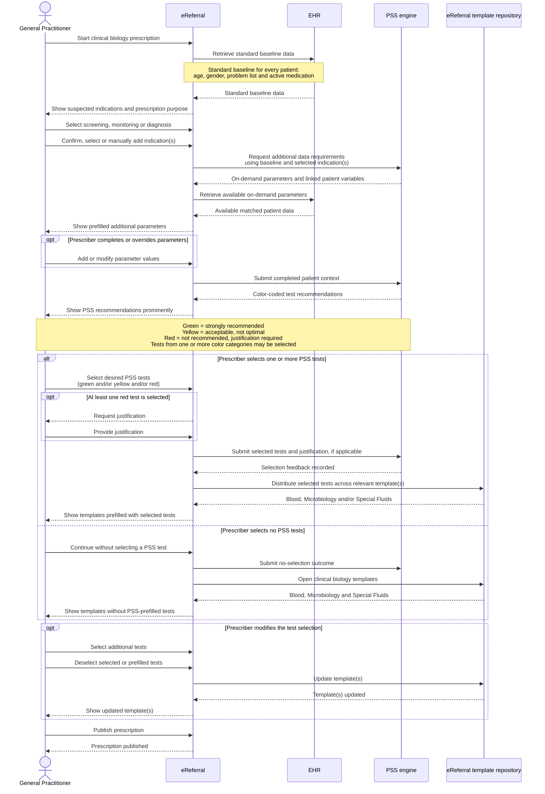
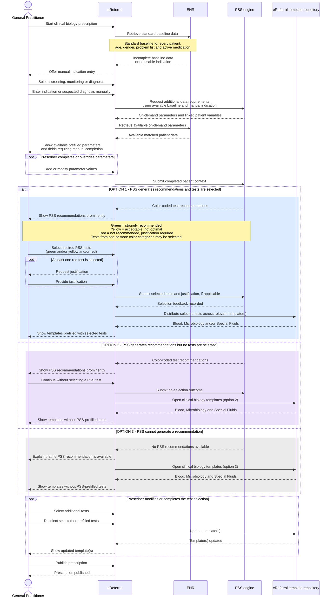
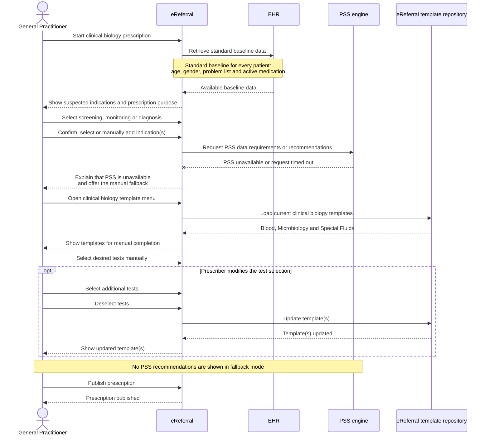

# PSS – eReferral Clinical Biology

This document visualizes three workflow variants for integrating **Prescription Search Support (PSS)** into the **RIZIV-INAMI eReferral platform** for clinical biology prescriptions.

The revised workflows incorporate the review feedback by:

- retrieving the same standard baseline for every patient without a PSS-triggered EHR request;
- making indication selection and manual indication entry explicit;
- retrieving additional PSS parameters from the EHR on demand;
- returning the selected tests and any required justification to PSS;
- allowing the prescriber to continue without selecting a PSS-recommended test;
- showing PSS recommendations prominently before the clinical biology templates; and
- using templates as a manual fallback when PSS is unavailable, rather than as the starting point of the PSS workflow.

The Mermaid diagrams below are rendered directly by GitHub.

---

## Scenario 1 – PSS-first with sufficient baseline data

---

## Scenario 2 – Insufficient baseline data: manual indication entry and three outcomes

---

## Scenario 3 – PSS unavailable: manual-template fallback

---

## Actors and components

| Actor / component | Role |
|---|---|
| **General Practitioner** | Prescriber who selects the prescription purpose and indication, reviews PSS recommendations, selects tests and publishes the prescription |
| **eReferral** | Orchestrates the prescription workflow, retrieves baseline and on-demand patient data from the EHR, displays PSS recommendations and captures the prescriber's choices |
| **EHR** | Source of standard baseline data and available on-demand patient parameters |
| **PSS engine** | Determines which additional parameters are needed, generates color-coded recommendations and records selection feedback |
| **Template repository (eReferral)** | Provides the current Blood, Microbiology and Special Fluids templates used after PSS selection or as a manual fallback |

## PSS color coding

- **Green** – strongly recommended
- **Yellow** – acceptable, not optimal
- **Red** – not recommended; justification required
- **Combinations are possible** – the prescriber may select tests from multiple color categories, including all three

## Modelling assumption to validate

The diagrams model the **clinical biology template repository as an eReferral-managed component**, rather than as content stored in the EHR. This makes template ownership explicit in response to the review question, but the final ownership and maintenance responsibility should be confirmed with the solution architect and business owner.
