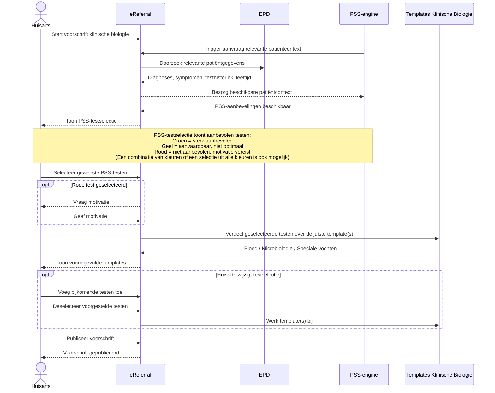
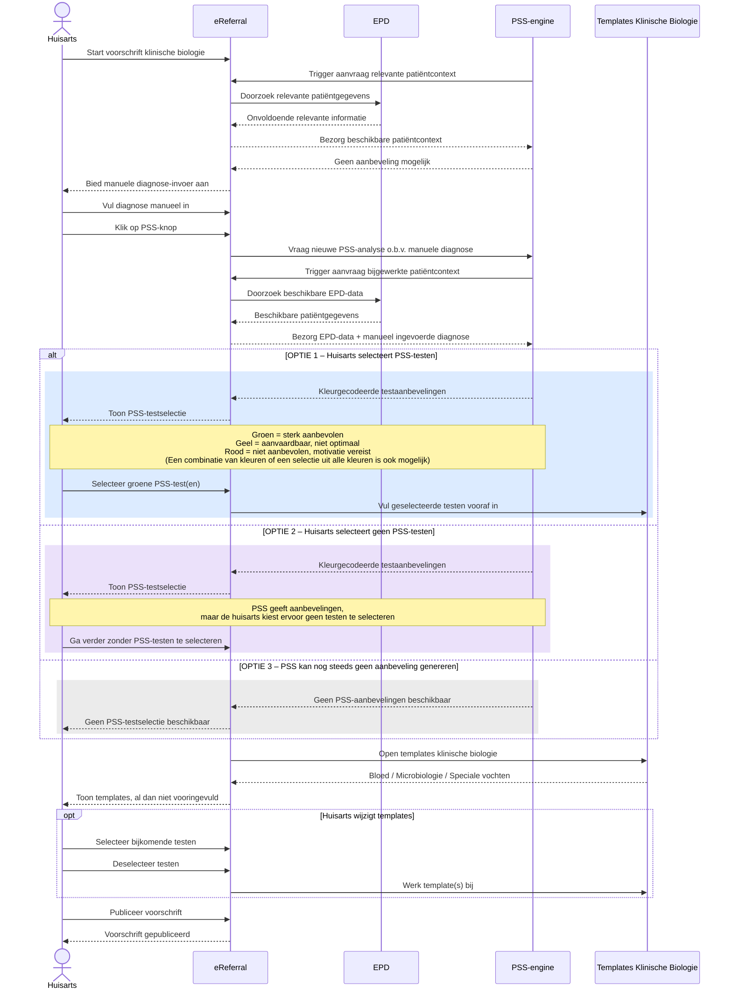
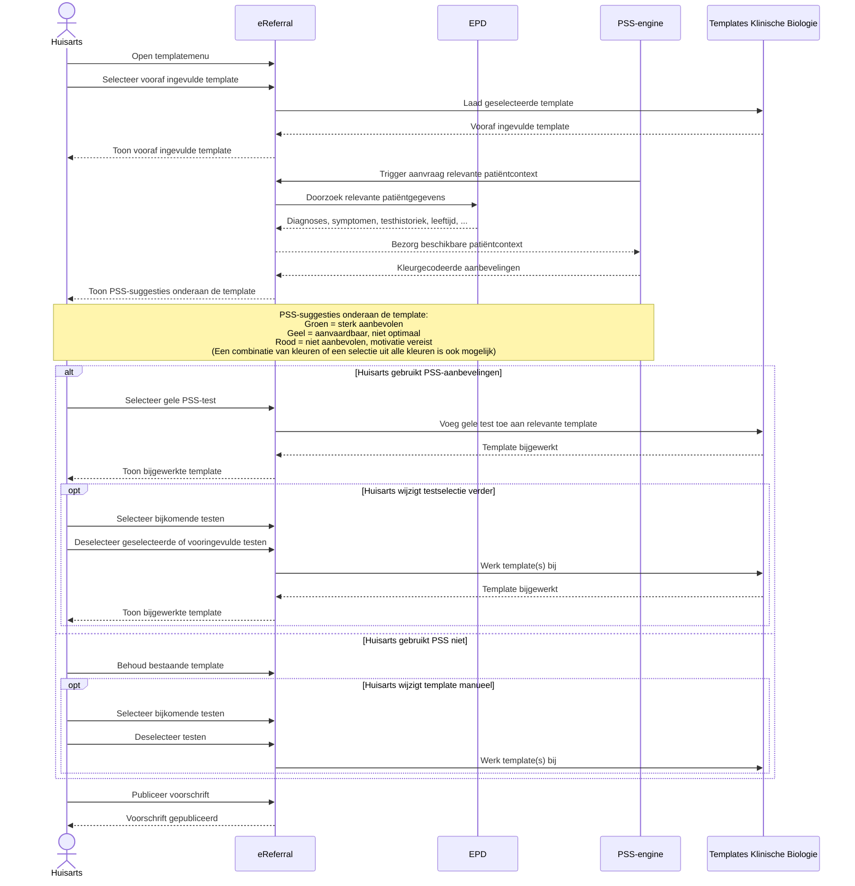

# PSS – eReferral Klinische Biologie

Dit document visualiseert drie mogelijke workflowvarianten voor de integratie van **Prescription Search Support (PSS)** binnen het **RIZIV-INAMI eReferral-platform** voor voorschriften klinische biologie.

De Mermaid-diagrammen hieronder worden rechtstreeks door GitHub gerenderd in Markdown.

---

## Scenario 1 – PSS-first: PSS-testselectie vóór de templates

---

## Scenario 2 – Onvoldoende EPD-data: manuele diagnose-invoer en drie mogelijke uitkomsten

---

## Scenario 3 – Vertrek vanuit een vooraf ingevulde template, gevolgd door PSS-suggesties

---

## Actoren en componenten

| Actor / component | Rol |
|---|---|
| **Huisarts** | Voorschrijver |
| **eReferral** | Platform waarin het voorschrift wordt aangemaakt en gepubliceerd; haalt relevante patiëntcontext op uit het EPD wanneer dit door PSS wordt getriggerd |
| **EPD** | Bron van diagnoses, symptomen, testhistoriek, leeftijd en andere relevante patiëntgegevens |
| **PSS-engine** | Triggert eReferral om relevante patiëntcontext op te halen en genereert kleurgecodeerde aanbevelingen voor klinische biologie |
| **Templates Klinische Biologie** | Bloed, Microbiologie en Speciale vochten |

## PSS-kleurcodering

- **Groen** – sterk aanbevolen
- **Geel** – aanvaardbaar, niet optimaal
- **Rood** – niet aanbevolen; motivatie vereist
- **Combinaties zijn mogelijk** – de huisarts kan testen selecteren uit meerdere kleurcategorieën, inclusief alle drie
